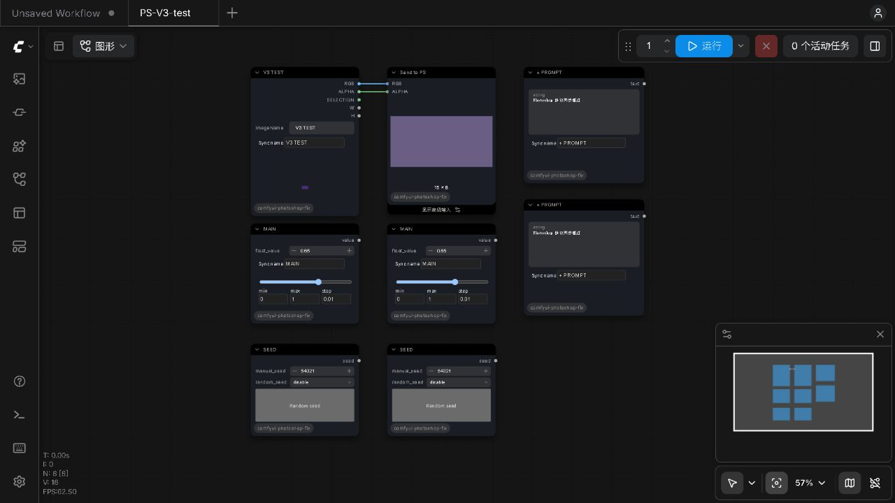

# V3 / Nodes 2.0 验证记录

日期：2026-10-01。当前版本：2.0.49-v3-preview.2。
以下迁移检查在 preview.1 完成；preview.2 的透明边缘复测结果见后文。

以用户选择的本机 2.0.49 为基线，保留其 Photoshop UXP 包和通信格式。
ComfyUI 节点已全部迁移到 V3；旧注册入口、旧聚合节点与旧绘制脚本已移除。
迁移细节见 [MIGRATION_V3.md](MIGRATION_V3.md)。

## 实际完成的检查

| 检查 | 结果 |
| --- | --- |
| ComfyUI 0.37.0 / 前端 1.53.6 / Python 3.13.12 无头启动 | 工作区和安装目录均成功，仅加载本插件 |
| 节点 API | 9 个 V3 节点注册成功，未注册旧聚合节点；所有类继承 io.ComfyNode |
| 实际执行 | 文本、Float、固定种子、带类型的任意直通、图像与发送节点通过；CLIP/MODEL 身份直通通过合约检查 |
| Photoshop 二进制协议 | MessagePack 图片上传、RGBA、选区、PNG 元数据、图像回传通过 |
| 图像边界 | 只更新选区触发重算、透明度缩放与批次广播、6 张保存/最多 4 张传送、PNG 转 JPEG 和超过 8K 输入通过 |
| Nodes 2.0 网页 | 同名文本/Float/Seed 同步、不同分组独立、重新加入分组、随机种子、自动随机、保存与重载通过 |
| 网页与模拟 Photoshop 客户端 | 接收到四类参数槽；远程文本、Float、种子更新正常；运行后收到开始/完成状态和一张 16×8 图像 |
| 控件回归 | 原生 value setter 回调递归、静默程序更新、独立 widget 对象、恢复时不回送通过 |
| rgthree 状态合约 | 当前 toggle 方法保持完整，读取 value.toggled 并调用 doModeChange；兼容布尔状态，排除附加 DOM 控件 |
| RemoteConnection 合约 | 模拟连接验证两个输出、选区保存/恢复、归一化和临时文件清理 |
| 附带工作流 | 五个 SD1.5 示例和 v3-smoke.json 的链接信息一致，均无旧聚合节点 |
| 语法 | Python 编译和全部插件 JS 语法检查通过 |
| 部署复核 | 安装目录提供的网页文件与源码哈希一致；发送节点实际输出 16×8 图像；网页运行完成并显示 24×24 缺图占位输出 |

后端图片测试使用合成数据，网页协议对端使用模拟客户端。测试在 CPU 上运行，
数据库、设置、输入、输出和临时目录均使用独立测试位置。
测试启动器显式设置数据库路径，避免 ComfyUI 自动迁移用户数据库。

原始测试报告保存在工作区 `F:\PS-Comfyui\.tests` 的 integration.json、contracts.json、
browser-peer.json、installed-check.json 和 sync.json；日志为 headless-final.log、installed-headless.log。

## 本机同步与备份

- 后端已同步到 `E:\ComfyUI-Work\ComfyUI\custom_nodes\comfyui-photoshop`。
- 同步时更新 36 个文件，清除 9 个过时文件；安装目录原有 7 个图片/选区数据文件哈希保持一致。之后补充本验证文档与截图。
- Photoshop 安装目录 `D:\Program Files\Adobe Photoshop 2026\Plug-ins\3e6d64e0`
  与工作区 2.0.49 UXP 包逐文件一致，本次迁移无需改动其打包界面。
- 修改前的完整备份：`F:\PS-Comfyui\backups\v2.0.49-before-v3`。
- 当前本地预览包：`F:\PS-Comfyui\releases\comfyui-photoshop-2.0.49-v3-preview.2.zip`；保留 preview.1 用于比较和回退。
- 未上传 Git 仓库；本次启动的隔离测试服务已在测试后停止。正常使用时启动/重启 ComfyUI，刷新 Photoshop 面板里的网页。

## 测试边界

未运行实际生成模型，也未执行附带 SD1.5 工作流的完整生成。
真实 Photoshop 画布写回、Remote Connection、Photopea 外部编辑/保存，以及第三方 rgthree
完整界面交互仍需宿主验收；本次通过的是节点执行、网页和协议测试。

前端启动时出现 `ComfyApp graph accessed before initialization`。
禁用全部自定义节点的对照服务也出现同一消息，属于当前 ComfyUI 前端初始化问题。
最终网页运行未出现插件回调递归或插件模块加载异常。

## preview.2 透明边缘白边修复

用户在 RGB / ALPHA 直接回传时发现浅色边缘。原因是读取节点沿用旧版白底合成，
再将原 Alpha 附回已被提亮的 RGB。现在输出 PNG 的原始 RGB，不预合成背景；
同时更新输入指纹，让修复后的处理与旧结果区分。

- 合约测试增加透明、半透明、完全不透明像素的 RGB 保真检查，通过。
- 无头集成测试增加实际输出 PNG 与 Photoshop render_batch 的 RGBA 像素检查，原有七组检查均通过。
- 使用用户当前 1143×2048 PNG 完成真实节点读取、保存和模拟 Photoshop 协议回传。
  1,069,022 个半透明像素；全图 RGBA 最大误差为 0，边缘 RGB 最大误差为 0，
  黑底和白底合成差异均为 0。报告为 `.tests/alpha-real-image.json`。
- 修改前的当前文件另存到 `F:\PS-Comfyui\backups\v3-preview.1-before-alpha-fix`。
- 修复已同步安装目录。用户原有 ComfyUI 进程保持运行，需要重启它才能加载新的 Python 代码。

此次未操作真实 Photoshop 画布，也未重新运行生成模型。
